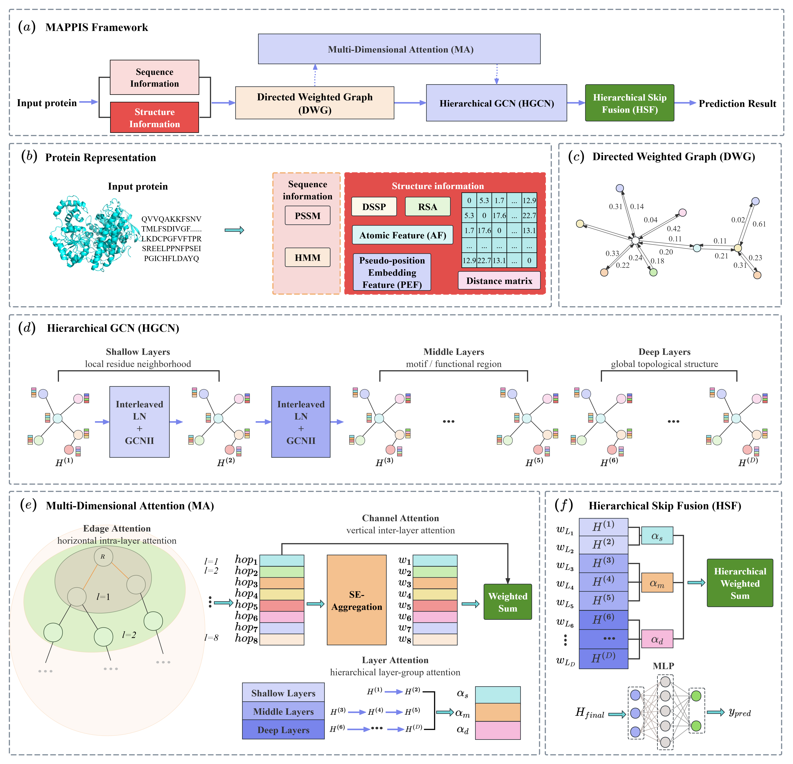
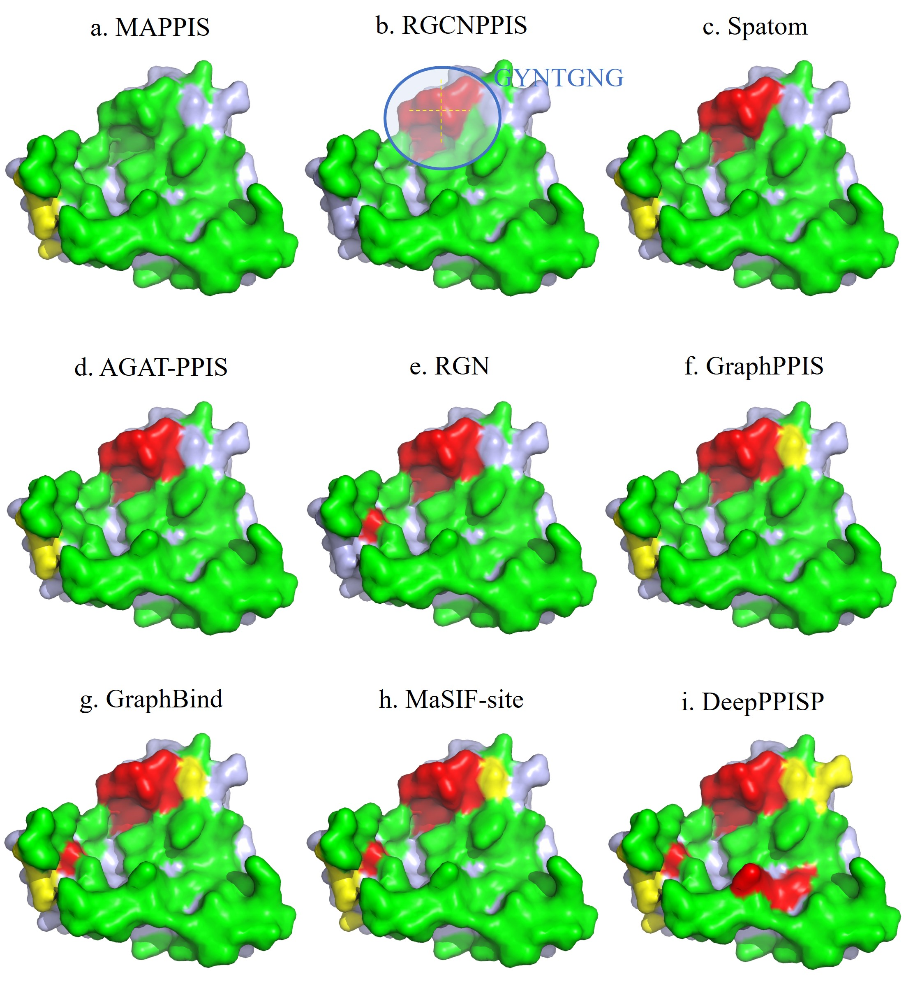
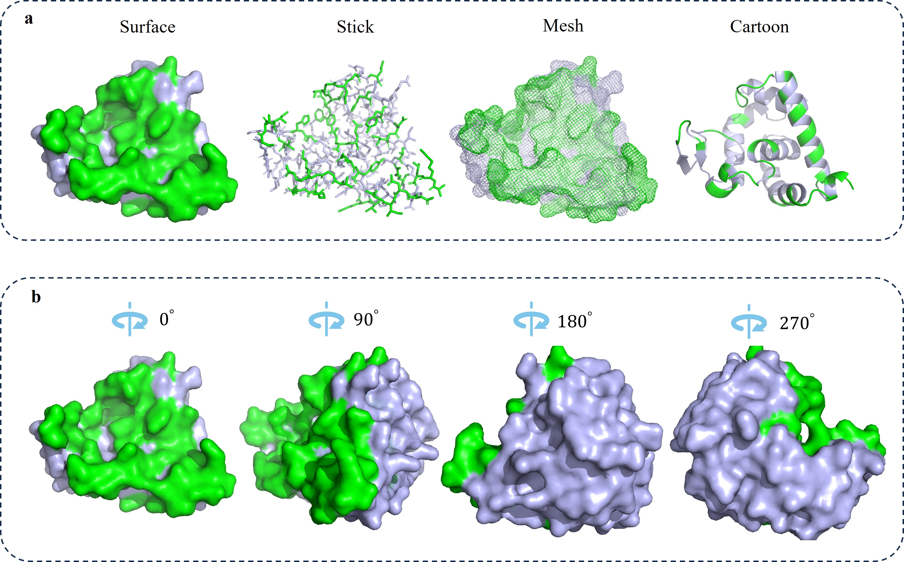

<div align="center">
  <h1>MAPPIS：Efficient Multi-dimension Attention Framework for Protein-Protein Interaction Site Prediction</h1>
</div>


## Introduction
</p align="justify">
Protein–Protein Interaction Site (PPIS) prediction plays a crucial role in understanding protein functions, elucidating disease mechanisms, and guiding drug discovery. Although traditional experimental methods can provide high-resolution structural information, they are costly and time-consuming, making them unsuitable for large-scale analysis. In recent years, deep learning approaches—particularly stacked Graph Neural Networks (GNNs) and attention mechanisms—have demonstrated superior performance in PPIS prediction. However, existing methods still face challenges such as fragmented multi-scale and hierarchical semantic modeling, as well as efficiency bottlenecks and representation degradation caused by structural complexity. To address these issues, we propose MAPPIS, a multi-dimensional attention-enhanced hierarchical graph neural network framework. MAPPIS jointly models intra-layer, inter-layer and layer-group attention to construct a unified multi-dimensional attention mechanism, enabling effective integration of multi-scale biochemical and structural features. In addition, a hierarchical deep graph architecture is introduced to enhance representation capability while alleviating over-smoothing, and to reduce computational complexity and memory overhead. Experimental results on multiple benchmark datasets demonstrate that MAPPIS consistently achieves state-of-the-art accuracy while exhibiting remarkable computational time and space efficiency compared to leading methods, highlighting its potential in large-scale biological applications.
</p>

 

## Dependency
```markdown
python                    3.10.18
dgl                       2.2.1
freesasa                  2.2.1
matplotlib                3.10.0
numpy                     2.1.2
pandas                    2.3.1
scikit-learn              1.6.1
torch                     2.3.0
torch-cluster             1.6.3
torch-geometric           2.5.0
torch-scatter             2.1.2
torch-sparse              0.6.18
torch-spline-conv         1.2.2
torchaudio                2.3.0
torchdata                 0.8.0
torchvision               0.18.0
```

## Train and Test

### Train
start training
if use AttPreSite_model.py
```markdown
python AttPreSite_model.py
```
output
```markdown
./Model/fold1_best_model.pkl
./Model/fold2_best_model.pkl
...
./Model/full_model_30.pkl
```

if use AttPreSite-Ligand_model.py
```markdown
python AttPreSite-Ligand_model.py --ligand RNA --trans
```
output
```markdown
./Model/fold1_best_model.pkl
./Model/fold2_best_model.pkl
...
./Model/full_model_30.pkl
```

### Test
start testing
if use AttPreSite_model.py
```markdown
python AttPreSite_model.py
```
output
```markdown
Test_60:
Test loss:  0.35188861563801765
Test binary acc:  0.8532410225197808
Test precision: 0.5292
Test recall:  0.6375903614457832
Test f1:  0.5783606557377049
Test AUC:  0.8730095882672436
Test AUPRC:  0.5954371390159193
Test mcc:  0.49356660367384997
Threshold:  0.29

Test_315-28:
Test loss:  0.3352209431109528
Test binary acc:  0.8613687557970054
Test precision: 0.50909428359317
Test recall:  0.6404389446649544
Test f1:  0.5672629510908903
Test AUC:  0.881639916372179
Test AUPRC:  0.5846846871636862
Test mcc:  0.4905450545869246
Threshold:  0.4

BTest_31:
Test loss:  0.3097736287501551
Test binary acc:  0.8623839244938347
Test precision: 0.48627450980392156
Test recall:  0.713463751438435
Test f1:  0.5783582089552238
Test AUC:  0.8915595663497061
Test AUPRC:  0.6005335030075699
Test mcc:  0.5127453818159148
Threshold:  0.17

BTest_31-6:
Test loss:  0.29347263753414154
Test binary acc:  0.8743178717598908
Test precision: 0.5009505703422054
Test recall:  0.713125845737483
Test f1:  0.588498045784478
Test AUC:  0.8971802369715172
Test AUPRC:  0.60762077430879
Test mcc:  0.5282226538371553
Threshold:  0.17

UBtest_31-6:
Test loss:  0.3668563061952591
Test binary acc:  0.8299814094980564
Test precision: 0.36176194939081535
Test recall:  0.5428973277074542
Test f1:  0.4341957255343082
Test AUC:  0.8118437397506826
Test AUPRC:  0.4116572608571926
Test mcc:  0.3485157642515198
Threshold:  0.18
```

if use AttPreSite-Ligand_model.py
```markdown
python AttPreSite-Ligand_model.py --ligand RNA --trans
```
output
```markdown
DNA-Test_129:
Test loss:  0.17306546022205851
Test binary acc:  0.9235505797680927
Test precision: 0.41608765366114375
Test recall:  0.6950892857142857
Test f1:  0.5205616850551655
Test AUC:  0.932489375569505
Test AUPRC:  0.5233944364174145
Test mcc:  0.5006401050722077
Threshold:  0.32
```

## Visualization Results


<p align="justify">
This figure shows the comparison of binding site prediction performance between MAPPIS and eight existing methods on the same protein sample. Green regions represent non-binding residues;
Red regions represent predicted binding residues;
Yellow regions represent predicted binding residues with disagreement among methods;
Purple regions represent true binding residues.
</p>



<p align="justify"> This figure shows multiple visualization styles and rotational views of the 3D structure of the protein.</p>
